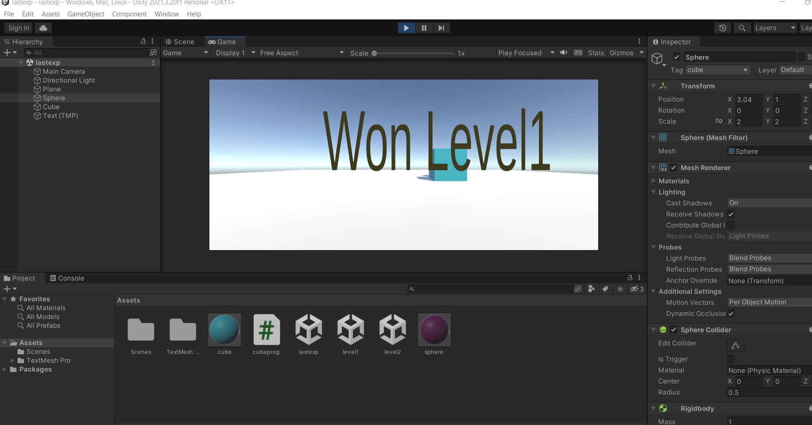

# Redirecting-the-scene

## Aim:
To develop Redirecting the scene in the unity engine using c# coding.

## Algorithm:
### Step 1:
Open the unity engine.

### Step 2:
Create a new plane and create a cube and give color for the cube.

### Step 3:
Next create sphere in the orgin and change the z-axis and Give the color for the sphere.

### Step 4:
Create a tag for the Sphere and Make the sphere and cube as a Rigidbodies and Make the sphere use Gravity.

### Step 5:
Create the C# script file in the Assets and write the Coding for the Redirecting.

### Step 6:
Next Create a another new scene named as page2.

### Step 7:
In File->Build settings and drop the both first scene and page2 scene in the Scenes in build setting.

### Step 8:
Click the Build and run button in the Build settings and run the scene.

### Step 9:
The Sphere after touching the cube it will disappeared and Press the key [R] the redircting to the new scene that is page2.

## Program:
```
Reg No : 212221230107
Developed by : M.Sowmya
```
```
using System.Collections;
using System.Collections.Generic;
using UnityEngine.SceneManagement;
using UnityEngine;


public class cubeprog : MonoBehaviour
{
    Rigidbody rb;
    public GameObject WinText;
    // Start is called before the first frame update
    void Start()
    {
        rb = GetComponent<Rigidbody>(); 
    }

    // Update is called once per frame
    void Update()
    {
        if(Input.GetKeyDown(KeyCode.R))
        {
            SceneManager.LoadScene("level2");
        }
        
    }
    public void OnMouseDown()
    {
        Destroy(gameObject);
    }
    private void OnCollisionEnter(Collision collision)
    {
        if(collision.gameObject.tag=="cube")
        {
            Destroy(collision.gameObject);
            WinText.SetActive(true);
        }
    }
}

```

## Output:




## Result:
Thus the above C# coding is successfully redirecting the scene in the unity engine.
